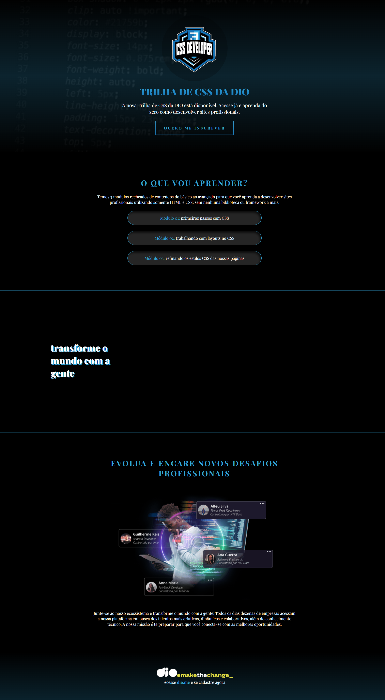

# Desafio 01: Criando minha primeira Landing Page com HTML e CSS

Bem vindo(a) ao resultado do meu primeiro desafio na Trilha de CSS da DIO! Nela, eu construí minha primeira Landing Page com HTML e CSS, colocando em prática os fundamentos do CSS, as propriedades básicas da linguagem de estilização, além de trabalhar com as unidades de medidas relativas e absolutas que aprendemos ao longo da trilha.

[Clique aqui](https://htolentino.github.io/Trilha-CSS-Desafio-01---DIO/) para acessar o resultado final da Landing Page criada por mim a partir do desafio!

